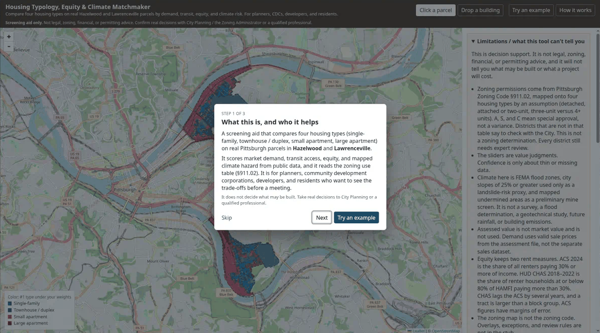
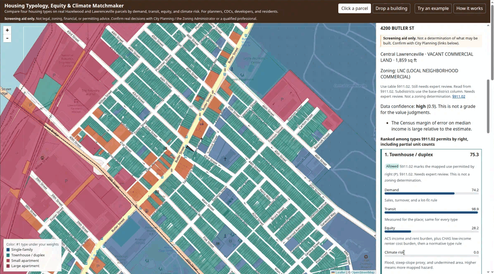
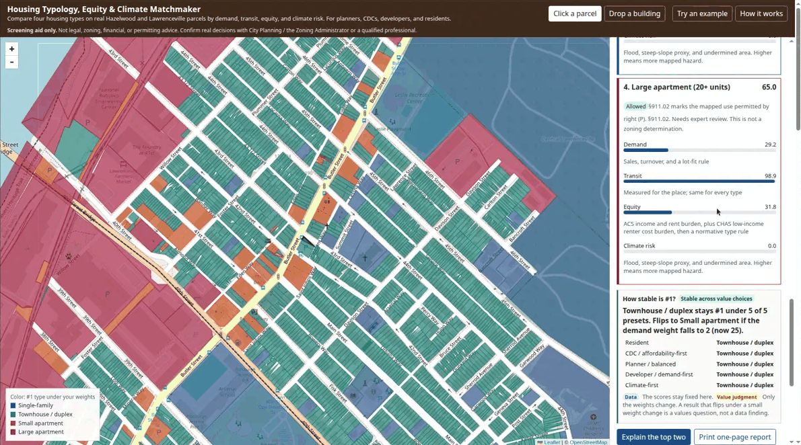
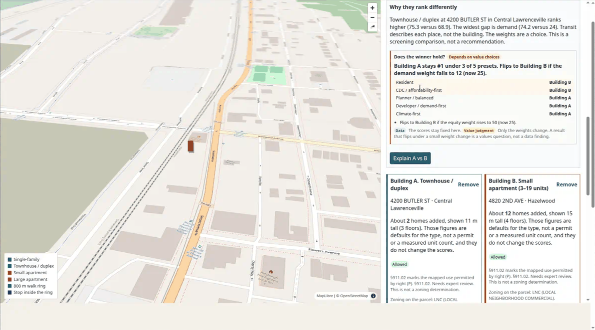
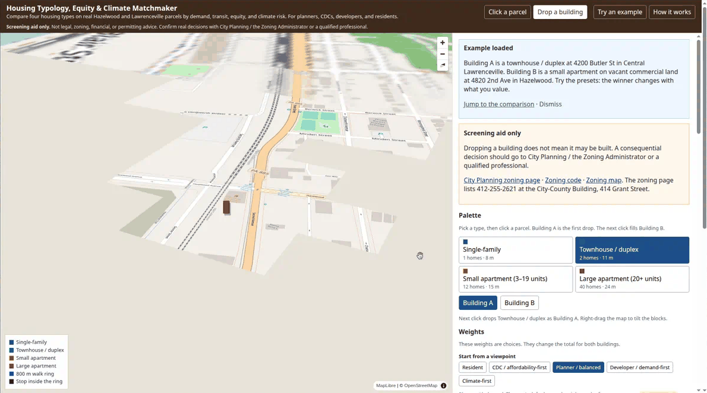
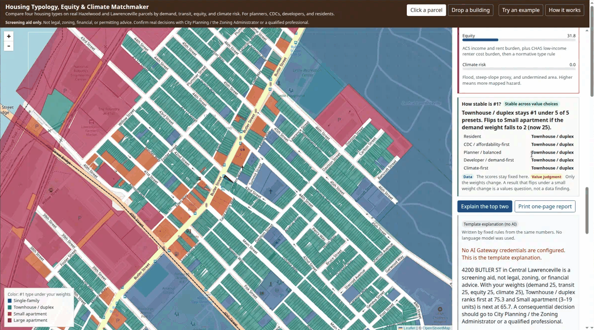
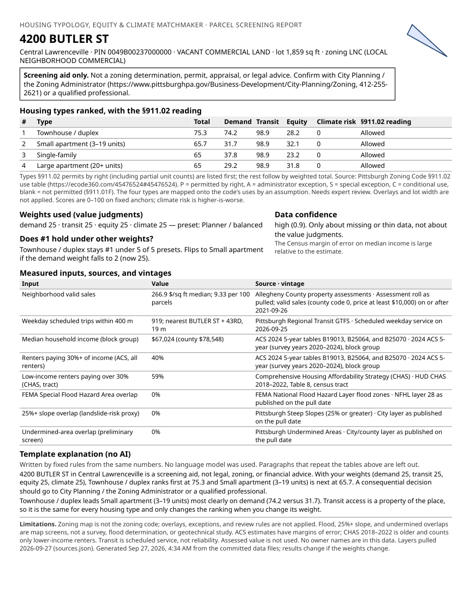
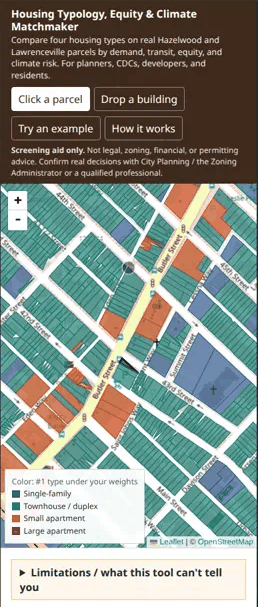

# Housing Typology, Equity & Climate Matchmaker

Decision-support prototype for the AI Horizons 2026 AI for Housing Hackathon, Challenge 3. Pick a real Pittsburgh parcel and compare four housing types — single-family, townhouse/duplex, small apartment (3–19 units), and large apartment (20+ units) — on demand, transit access, equity, and climate risk. Weight sliders re-rank the types. The screen labels which parts are observed data and which parts are value judgments.

This is not legal, zoning, financial, or permitting advice. It does not say what may be built.

## Who it helps

- Municipal planners testing how a housing mix shifts when equity or climate counts more than market demand.
- Community development corporations comparing a place like Hazelwood with a place like Lawrenceville before choosing a building type.
- Developers looking at lot size, recent valid sales, and transit as context, not as a pro forma.
- Residents and public officials who want two scenarios side by side, including a "what if the zoning rules were not binding" view.

The MVP map is Hazelwood plus Lower, Central, and Upper Lawrenceville. Those are the official city neighborhoods. "Lawrenceville" in everyday speech is the three Lawrenceville neighborhoods together.

## Features

| | |
| --- | --- |
| **First-run guide and example.** A three-step intro says what the tool is and who it is for. **Try an example** loads a Lawrenceville townhouse vs a Hazelwood small apartment, both on LNC lots where §911.02 permits the type by right. **How it works** reopens the guide. |  |
| **Click a parcel.** All four types ranked for one lot, with the §911.02 reading per type (allowed, needs special approval, not allowed, or check with the City), every score bar, and data confidence. Choosing an address flies the map to the lot. The URL keeps `?pin=` so a parcel can be shared. |  |
| **Weight presets.** Resident, CDC / affordability-first, Planner / balanced, Developer / demand-first, and Climate-first set the sliders in one click. The screen says presets are value judgments, not data. |  |
| **How stable is #1?** For a parcel, and for the two-building compare, the app reruns the ranking under all five presets and under one-slider changes. It reports, for example, "Townhouse / duplex stays #1 under 5 of 5 presets. Flips to Small apartment if the demand weight falls to 2." When §911.02 leaves only one type, it says zoning, not the weights, decides #1, and shows the what-if result too. |  |
| **Drop a building.** Put one type on a lot in 3D with an 800 m walk ring and nearby transit; drop a second to compare A and B side by side. |  |
| **Explanations.** "Explain the top two" or "Explain A vs B" streams an AI summary labeled "AI-generated summary of the scores above; check sources", or the template when no model is available, with the reason shown. |  |
| **One-page report.** "Print one-page report" prints the parcel, zoning reading with the §911.02 citation, scores, weights and preset, robustness, measured inputs with sources and vintages, the summary, limitations, and the "screening aid, confirm with City Planning" note. Save as PDF for a community meeting. |  |
| **Works on a phone and with a keyboard.** The layout stacks under 900 px. There is a skip link to the results, visible focus outlines, labeled controls, live regions for streamed text, and an address search for anyone who cannot click the map. |  |

## How to use it

1. Open the app. Read the three-step guide, or click **Try an example**.
2. **Click a parcel** on the map, or type an address (add a house number, such as `4200 butler`, to narrow the list).
3. Read the ranked cards and the §911.02 badges. Anything marked "needs special approval" is not a variance and not a denial.
4. Pick a viewpoint preset, or move the sliders. Watch **How stable is #1?**: if the result flips under a small change, the answer is about values, not data.
5. **Drop a building** to compare two scenarios, then check **Does the winner hold?**
6. Click **Explain** for a plain-language summary, or **Print one-page report** to bring it to a meeting.
7. If a result looks wrong, flag it (the flag stays in your browser). Take real decisions to City Planning / the Zoning Administrator or a qualified professional.

Why these two places: the public data actually separates them. In this pull, parcel block-group median incomes are about $40,000 in Hazelwood and about $101,000 in Lawrenceville. Median rent burden (share of renters paying 30% or more) is about 58% in Hazelwood and 34% in Lawrenceville. Median valid sale prices since 2021-09-26 are about $153 per square foot in Hazelwood and $247–$274 in the Lawrenceville neighborhoods. Lawrenceville also has more weekday transit trips within 400 meters (median about 950 versus about 420). Slopes of 25% or greater, the landslide-risk proxy, touch about 57% of Hazelwood parcels and about 15% of Lawrenceville parcels. Mapped undermined areas show up on about 13% of Hazelwood parcels and on none of these Lawrenceville parcels. Mapped FEMA flood zones are the other way around: about 6% of Lawrenceville parcels and under 1% of Hazelwood parcels. Glen Hazel is not included; it is its own neighborhood.

## How to run

Pipeline (Tejas):

```bash
cd pipeline
python3 -m venv .venv
source .venv/bin/activate
pip install -r requirements.txt
python test_score.py
python test_pii.py
python run_pipeline.py
```

`python run_pipeline.py --refresh` ignores cached downloads in `pipeline/data/raw/`.

App (YY):

```bash
cd web
npm install
npm test
npm run dev
```

Open http://localhost:3000. The default view is click a parcel. **Drop a building** is the second mode: pick one of the four types, click a parcel, and a block extrudes on that lot with an 800 meter walk ring. Drop a second building to compare them. Each result is a screening aid. Flag a result that looks wrong; the flag stays in that browser and is not sent to the City. A consequential decision should go to City Planning / the Zoning Administrator or a qualified professional. See [Human in the loop](#human-in-the-loop) and [Drop a building](#drop-a-building).

### One-minute demo

1. Open the app and click **Try an example** (in the guide or the header). Building A is a townhouse / duplex at 4200 Butler St, Central Lawrenceville. Building B is a small apartment at 4820 2nd Ave, Hazelwood. Both lots are LNC, where §911.02 permits both types by right.
2. Click **Jump to the comparison**. With balanced weights, A ranks higher. **Does the winner hold?** says A stays #1 under 3 of 5 presets: Resident and CDC pick B. That split is a values question, not a data finding.
3. Click the **CDC / affordability-first** preset and watch B take the lead. Click **Planner / balanced** to go back.
4. Switch to **Click a parcel**, search `4200 butler`, and open the parcel. Read the §911.02 badges and **How stable is #1?**, then click **Print one-page report**.
5. Right-drag the 3D map to tilt it. The plain click-a-parcel map is always one click away in the header.

For a plain-language explanation, click "Explain the top two" on a parcel, "Explain this parcel" on a dropped building, or "Explain A vs B" once two buildings are dropped. The text streams from a language model through the Vercel AI Gateway and is labeled **AI-generated summary of the scores above; check sources**. With no gateway credentials, or if the model errors or times out, the same button returns the deterministic template and is labeled **Template explanation (no AI)** with the reason. See [AI explanations](#ai-explanations).

To use the model locally, copy `web/.env.example` to `web/.env.local` and set `AI_GATEWAY_API_KEY` (create one under AI Gateway → API Keys in the Vercel dashboard), or run `vercel link` then `vercel env pull .env.local` inside `web/` to get a short-lived OIDC token. Optional: `AI_MODEL` (default `anthropic/claude-haiku-4.5`), `AI_EXPLANATIONS=off` to force the template.

On Vercel, set the project root to `web`. The gateway authenticates with the project's OIDC token automatically, so no key is needed there. Nothing in `web/` depends on running the Python pipeline at deploy time: the app and the explain API both read the committed files in `web/public/data/`.

After Chris edits `zoning/districts.json`:

```bash
cp zoning/districts.json web/public/data/zoning.json
cp zoning/districts.json data/processed/zoning.json
```

Scores do not depend on that file. A rules-only edit does not need a full data download.

## Architecture

```text
pipeline/          Tejas. Download, clean, score. Writes data/processed and web/public/data.
  score.py         Measured inputs vs normative anchors. No zoning allowances.
zoning/            Chris. districts.json maps a zoning code to allowed housing types.
web/               YY. Next.js map. Ranks on the client from the static GeoJSON.
  app/api/explain  AI Gateway explanation grounded in server-side facts; template fallback.
  lib/explainFacts.js, lib/explainPrompt.js, lib/explainHandler.js
                   What the model may see, what it is told, and the guardrails.
  lib/presets.js, lib/robustness.js
                   Viewpoint presets, and whether #1 holds across presets and one-slider changes.
  components/ParcelReport.js, components/Onboarding.js
                   Print-only one-page report; first-run guide and example case (lib/example.js).
shared/rank_vector.json
                   One numeric example both the Python tests and the JS tests must match.
```

The pipeline stores the zoning district code it found on each parcel. The browser reads `zoning.json` and, once a person has cited a code section, decides what those rules mark as allowed. Turning on "what if zoning changed" ranks all four types and says so. Until then the click-a-parcel view does not filter types.

## Drop a building

Click a parcel stays available from the banner. Drop a building is a second mode on the same parcels and the same scores.

Pick one of the four types. Each has a default home count and height used only for the drawing and the "homes added" line: single-family 1 home / 8 m, townhouse/duplex 2 / 11 m, small apartment 12 / 15 m, large apartment 40 / 24 m. Those defaults do not change the score.

Click a parcel. MapLibre draws a 3D block on the lot. An 800 meter ring (about a 10-minute walk) is drawn from the parcel. PRT stops inside that ring are marked, with a count of stops and weekday scheduled trips. If the parcel overlaps a FEMA flood zone or a 25%+ slope, that lot is tinted. The card shows homes added, demand, transit, equity, climate risk, and the weighted total. Each line is tagged measured or a weighting choice. The zoning badge reads §911.02: allowed (P), needs special approval (A, S, or C), a split such as triplex allowed and 4+ units not, or not allowed when the cell is blank. Districts that are not in the table say to check with the City instead of not allowed. Every badge still says it needs expert review.

Drop a second building, on the same parcel or another one, and the two cards sit side by side with a sentence on why one ranks higher. The disclaimer and the flag control stay on the card. The flag stays in the browser.

Stop dots come from `data/processed/stops.geojson`, the same weekday GTFS counts as the parcel scores, limited to stops near the two neighborhoods.

Composite score = weighted average of demand, transit, equity, and climate suitability (100 minus climate risk). A missing dimension is skipped. It is not treated as zero.

How the sources are reconciled when they disagree (vintage, geography, join keys, and mismatches) is in [docs/DATA_NOTES.md](docs/DATA_NOTES.md).

## Data Sources

Most layers were pulled 2026-09-26. The CHAS tract file was pulled 2026-09-27. Names, URLs, and caveats follow the organizers' data resource list. Machine-readable copy, including the caveat text: `data/processed/sources.json`.

| Source (organizers' list) | List URL | Caveat we are respecting | What this MVP actually used |
| --- | --- | --- | --- |
| Pittsburgh neighborhoods (not a row on the list; the comparison boundary) | [WPRDC GeoJSON](https://data.wprdc.org/dataset/e672f13d-71c4-4a66-8f38-710e75ed80a4/resource/4af8e160-57e9-4ebf-a501-76ca1b42fc99/download/neighborhoods.geojson) | Official neighborhood names, not nicknames | Hazelwood, Lower Lawrenceville, Central Lawrenceville, Upper Lawrenceville. CC BY. |
| Allegheny County Parcel Boundaries | [data.wprdc.org/dataset/allegheny-county-parcel-boundaries](https://data.wprdc.org/dataset/allegheny-county-parcel-boundaries) | Geometry and assessment records may update on different schedules | That list URL returned HTTP 404. Live page: [allegheny-county-parcel-boundaries1](https://data.wprdc.org/dataset/allegheny-county-parcel-boundaries1). Polygons read from the county MapServer. 8,645 parcels after the clip. |
| Allegheny County Property Assessments | [property-assessments](https://data.wprdc.org/dataset/property-assessments) | Assessed value is not market value; fields can be stale | CC0 extract. Land use, lot area, year built, living area, and sale fields. Assessed value is not read. Owner names and change-notice addresses are not in the extract. |
| Allegheny County Property Sale Transactions | [list URL](https://data.wprdc.org/dataset/allegheny-county-property-sale-transactions) | Filter with sale-validation codes; many transfers are not arm's-length | Not downloaded. The list URL 404'd; the live page is [real-estate-sales](https://data.wprdc.org/dataset/real-estate-sales). The same filter is applied to sale fields on the assessment file: `VALID SALE` only. |
| Pittsburgh Zoning Districts | [pittsburgh-zoning](https://data.wprdc.org/dataset/pittsburgh-zoning) | The map alone is not enough: overlays, definitions, exceptions, and review rules matter | List URL 404'd. Live page: [zoning](https://data.wprdc.org/dataset/zoning). Feature service supplies `zon_new` only. Allowances are the stub in `zoning/districts.json`. |
| Pittsburgh Zoning Code | [§911.02 Use Table](https://ecode360.com/45476524#45476524) | Authoritative interpretation belongs to the City | Residential rows of §911.02, mapped onto the four housing types by an explicit assumption. A/S/C are special approval. Districts that are not in the table say to check with the City. Still needs expert review. Not a legal determination. |
| American Community Survey 5-Year | [ACS 5-year](https://www.census.gov/data/developers/data-sets/acs-5year.html) | Estimates have margins of error; avoid false precision for small areas | 2024 5-year table files B19013, B25064, B25070. County median income in this file is $78,548. |
| Comprehensive Housing Affordability Strategy (CHAS) | [HUD CHAS](https://www.huduser.gov/portal/datasets/cp.html) | Based on multi-year ACS; releases lag and the tables are complex | 2018–2022 Table 8, census tract summary level 140, from [2018thru2022-140-csv.zip](https://www.huduser.gov/portal/datasets/cp/2018thru2022-140-csv.zip). Columns from the [2018–2022 dictionary](https://www.huduser.gov/portal/datasets/cp/CHAS-data-dictionary-18-22.xlsx). Equity uses the share of renter households at or below 80% of HAMFI paying more than 30% of income. ACS rent burden stays as well. |
| TIGER/Line Shapefiles | [TIGER/Line](https://www.census.gov/geographies/mapping-files/time-series/geo/tiger-line-file.html) | Boundary vintage must match the statistics | 2024 cartographic block groups (`cb_2024_42_bg_500k`), same GEOID year as the 2024 ACS tables. |
| Pittsburgh Regional Transit GTFS | [list URL](https://data.wprdc.org/dataset/port-authority-of-allegheny-county-transit-data) | Scheduled service is not realized reliability | List URL 404'd. Schedule read from the [PRT GTFS zip](https://www.rideprt.org/developerresources/GTFS.zip) under the [developer license](https://www.rideprt.org/business-center/developer-resources/). Weekday 2026-09-25. |
| FEMA National Flood Hazard Layer | [NFHL](https://www.fema.gov/flood-maps/national-flood-hazard-layer) | Not a substitute for a survey or a flood determination | MapServer layer 28: Special Flood Hazard Area and 0.2% annual-chance zones. |
| Pittsburgh Steep Slopes (25% or greater) | [25-or-greater-slope](https://data.wprdc.org/dataset/25-or-greater-slope) | Derived threshold; site work needs a survey | Parcel overlap. Labeled as a landslide-risk proxy, not a landslide inventory. The list has no landslide-prone layer. |
| Pittsburgh Undermined Areas | [undermined-areas](https://data.wprdc.org/dataset/undermined-areas) | Historic mine maps can be incomplete; never use alone for a safety decision | Parcel overlap, as a preliminary screen only. |
| OpenStreetMap | [openstreetmap.org](https://www.openstreetmap.org/) | Completeness varies; ODbL attribution | Basemap tiles only. Not a scored input. |

Stretch rows on the list that this build does not join: [EPA EJScreen](https://www.epa.gov/ejscreen/download-ejscreen-data) (a screening tool, not a risk assessment), [HUD Location Affordability Index](https://hudgis-hud.opendata.arcgis.com/datasets/c1c32742599a42c9a45c95be50ed2ab6_12/about) (modeled household profiles, not observed spending), [LODES](https://lehd.ces.census.gov/data/) (modeled, lagged jobs access), and the [Opportunity Atlas](https://www.opportunityatlas.org/) (historical cohort outcomes, not current conditions, and not a way to rank people).

The Census API (`api.census.gov`) redirected unauthenticated calls to a missing-key page on 2026-09-26. The ACS numbers above are the Bureau's own 2024 ACS 5-year summary files, not a substitute dataset. Nothing in the parcel file is invented to fill a failed source.

About 5% of clipped parcels (411 of 8,645) did not match an assessment row in ZIP 15201 or 15207. Those parcels stay on the map with lower confidence and without land use or sale fields. They are not given fake attributes.

## Libraries

- Python: shapely, pyshp (and the standard library)
- Web: Next.js, React, Leaflet, react-leaflet, MapLibre GL (drop-a-building view only), Vercel AI SDK (`ai` v7) for explanations
- Basemap tiles: OpenStreetMap, attributed on the map

No paid data product. No model is required for the scores. A language model only writes the optional explanation text, and the template covers it when the model is not available.

## AI Tools Used

- **Explanations in the app:** `anthropic/claude-haiku-4.5` (Anthropic Claude Haiku 4.5) through the [Vercel AI Gateway](https://vercel.com/docs/ai-gateway), called with the Vercel AI SDK. Set `AI_MODEL` to use another gateway model. The model writes prose only. It does not compute scores, choose weights, or read the zoning code. If it is unavailable, `web/lib/explainTemplate.js` writes the explanation from the same numbers, and the UI says so. The demo does not depend on a model being up.
- **Writing the code:** Cursor cloud agents helped write this repository. Grok 4.7 scaffolded the pipeline, the scoring model, and the first web app. Claude Opus 5.5 wrote the AI Gateway explanation route, the grounding and guardrails, the presets, the robustness check, the one-page report, the onboarding, and their tests. The five presets are value judgments that agent proposed; the team should confirm or change them in `web/lib/presets.js`. People on the team reviewed the scoring rules, which are in `pipeline/score.py` and `data/processed/score_model.json` so anyone can read and change them.

## AI explanations

The model sees only what the server builds in `web/lib/explainFacts.js`, from the committed files in `web/public/data/`. The browser sends parcel PINs, housing types, the four weights, and the what-if toggle; it cannot put its own numbers into the prompt. For a parcel, the facts are the four types' demand, transit, equity, and climate scores and weighted totals, the weights, the §911.02 reading for each type (including whether it needs special approval, the legend, the mapping assumption, and `needs_expert_review`), the flood, steep-slope, undermined, transit, income, ACS, and CHAS inputs, and each input's source name, vintage, pull date, and caveat. Shares are converted to whole percents on the server so the model never does arithmetic. Owner and deed-party fields are not in the data, and the facts builder does not copy any field it does not name.

The system prompt (`web/lib/explainPrompt.js`) asks for plain language for residents and planners. It asks the model to explain why the types or the two scenarios rank differently, keep measured findings apart from value judgments (the weights and scoring rules), state uncertainty and source vintages, use no number that is not in the facts, make no legal conclusion, and send real decisions to City Planning or a qualified professional.

Guardrails (`web/lib/explainHandler.js`): at most 600 output tokens; a 15 second total timeout and 8 seconds to the first token; an in-memory cache keyed by a hash of the model, prompt version, and facts (6 hours, 500 entries); 6 AI requests per minute per IP and 60 per minute per server instance; a 4 KB request limit; strict input validation. Past a limit, or on any error, the reply is the template with a notice. Tests: `web/lib/explain.test.js` (uses the AI SDK's mock model, no network).

How to check it locally: run `npm run dev` in `web/` with `AI_GATEWAY_API_KEY` set, click a parcel, and click "Explain the top two." The label under the button shows the model. Or call the API directly:

```bash
curl -N -X POST localhost:3000/api/explain -H 'content-type: application/json' \
  -d '{"kind":"parcel","pin":"0049B00013000000","weights":{"demand":25,"transit":25,"equity":25,"climate":25}}' -D -
```

The `x-explain-source` header is `ai` or `template`, `x-explain-model` names the model, `x-explain-cache` is `hit` or `miss`, and `x-explain-notice` gives the reason for a template fallback. For two dropped buildings, send `{"kind":"compare","weights":{...},"a":{"pin":"...","typeId":"small_apartment"},"b":{"pin":"...","typeId":"townhouse_duplex"}}`.

## Human in the loop

Every parcel result is a screening aid. It is not a zoning determination, a permit, or an appraisal. The page says so on the result, and it links to the [City Planning zoning page](https://www.pittsburghpa.gov/Business-Development/City-Planning/Zoning), the [zoning code](https://ecode360.com/45474054), and the [zoning map](https://pittsburghpa.maps.arcgis.com/apps/instant/sidebar/index.html?appid=4bb79ea64bf848b3a0560e3856efeccb). The zoning page lists 412-255-2621 at the City-County Building, 414 Grant Street.

The robustness check makes the value judgment visible: it shows which presets agree on #1 and how far one weight must move to flip it. The printed report carries the same screening note, the §911.02 citation, and the source vintages, and it includes a browser flag if there is one, so the paper copy is not stripped of its caveats.

A person can flag a result as wrong. The flag, and an optional note, stay in that browser's local storage. They are not uploaded and they are not a filing with the City. Take a consequential question to City Planning / the Zoning Administrator or to a qualified professional.

Zoning allowances are filled from §911.02, not from district titles. `needs_expert_review` remains true on every district. Chris should review the mapping, overlays, and the R1D lot-width rule before anyone treats a badge as a determination.

## Limitations

- Decision support only. Not a zoning determination, appraisal, underwriting tool, or permitting screen.
- Housing permissions are a reading of Pittsburgh Zoning Code §911.02 (https://ecode360.com/45476524#45476524), not a zoning determination. The assumption is: single-family = Single-Unit Detached; townhouse/duplex = Single-Unit Attached or Two-Unit; small apartment = Three-Unit for 3 units and Multi-Unit for 4–19; large apartment = Multi-Unit. Where Three-Unit and Multi-Unit differ, the screen says so. A, S, and C are labeled needs special approval. SP districts, planned developments, and other codes that are not use-table columns say to check with the City and are not marked prohibited. `needs_expert_review` stays true. Overlays and lot width are not applied. An earlier unattended request to ecode360 got HTTP 403; this reading uses a saved copy of the use-table page. Observed codes in this MVP include R1A-H, R1A-VH, H, R1D-M, LNC, UI, RIV-IMU, RIV-MU, P, NDI, and others.
- Weights, lot-fit curves, the equity production/displacement factors, the 50/30/20 flood, steep-slope, and undermined blend, and the small climate penalty by building size are value judgments. Confidence measures missing data only.
- Climate risk is current FEMA flood zones, overlap with slopes of 25% or greater as a landslide-risk proxy, and overlap with undermined areas as a preliminary mine screen. It is not a site visit, a flood determination, a geotechnical study, future rainfall, or embodied carbon or operating emissions. The brief also asks about infrastructure and marginal carbon; this MVP does not have those layers, so it does not score them. Steep slope is not a landslide inventory. Undermined-area maps can be incomplete and are not a safety determination.
- Valid sales are county code `0` / description `VALID SALE`, price at least $10,000, on or after 2021-09-26. Love-and-affection and multi-parcel deeds are excluded. This is not an appraisal. Assessed value is not market value (the organizers' caveat on the assessment file) and is not an input. The separate sale-transactions dataset was not downloaded; the validation-code filter from that row of the list is what the assessment sale fields go through.
- ACS figures are 2020–2024 estimates with margins of error. A block group is not a neighborhood, and a small-area percentage should not be read as exact. HUD CHAS in the equity score is the 2018–2022 tract share of renter households at or below 80% of HAMFI paying more than 30% of income. That is not the ACS rent-burden share: it is an older special tabulation, a larger geography, and a lower-income renter universe. The two are kept separate and then given equal weight in the need average when both are present. A missing CHAS tract is skipped, not filled with zero. Block-group geometries are NAD83 used as WGS84; that shift is small next to a block group, and the 2024 boundary vintage matches the 2024 ACS tables. It does not match the 2018–2022 CHAS vintage.
- The zoning district map does not encode overlays, definitions, exceptions, or review procedure. Authoritative interpretation belongs to the City. The code, the map, and the department page are linked from each result.
- Scores use fixed anchors (for example $80–$350 per square foot), not a citywide percentile. A high score means "high on that anchor," not "better than most of Pittsburgh."
- Transit is weekday scheduled trips, not delay, crowding, or whether the sidewalk exists.
- Owner names, change-notice mailing addresses, and buyer, seller, grantor, and grantee names are not in the output. The pipeline refuses a parcel file whose keys contain those words. Site addresses and sale prices stay; the parties do not. Do not join this file back to an owner roll or a deed-party file. Details are in [docs/DATA_NOTES.md](docs/DATA_NOTES.md).

## Team

- Tejas — data pipeline and scoring model (`/pipeline`, `pipeline/score.py`)
- Chris — zoning rules (`/zoning/districts.json`)
- YY — map and front end (`/web`)
