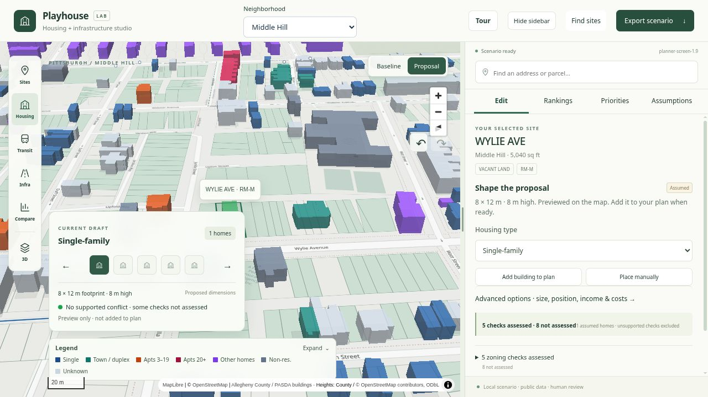
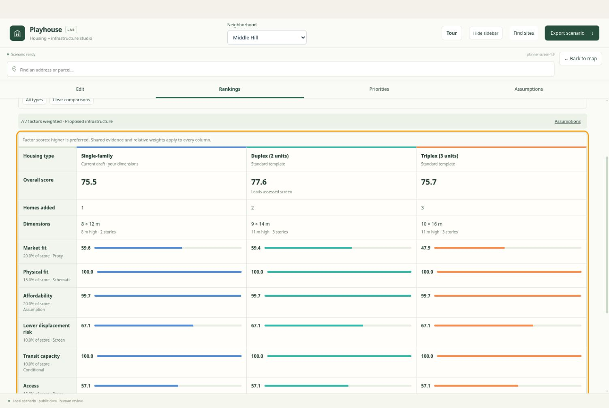
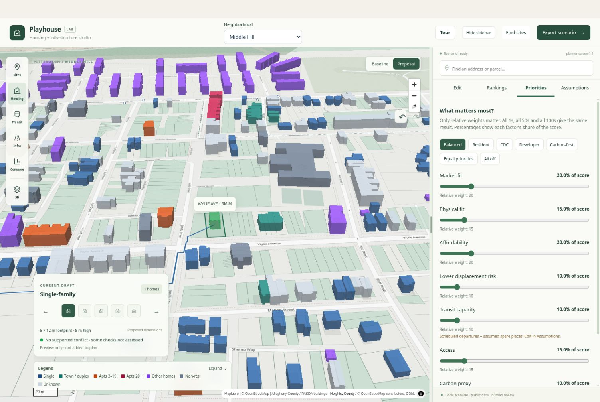
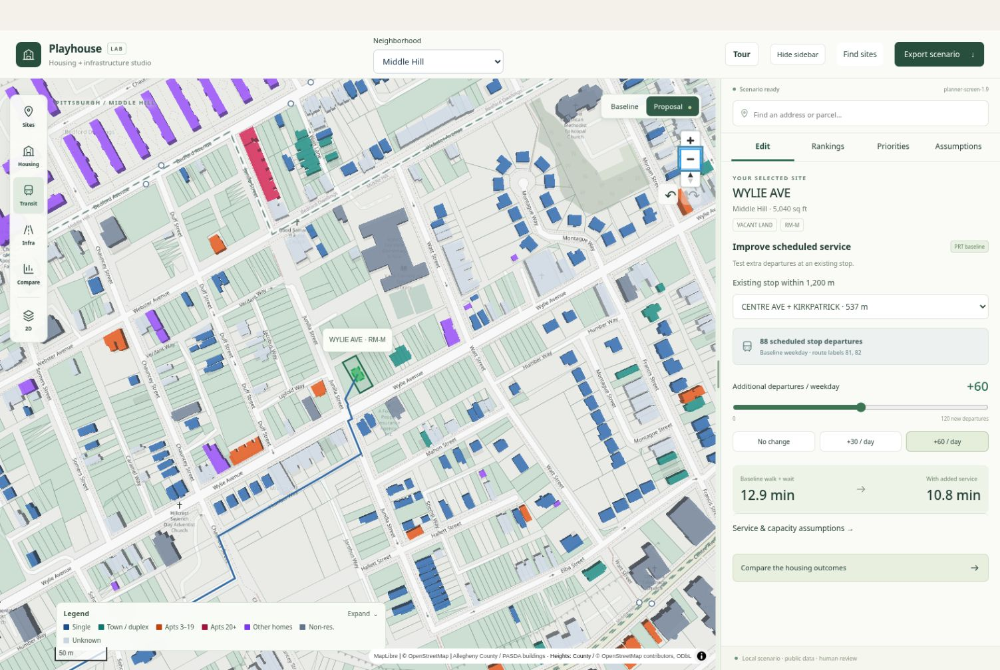

# Playhouse

Pittsburgh Planning Studio

by Hack the House

**Plan homes. Test infrastructure. Compare tradeoffs.**

Playhouse helps planners, developers and communities test housing and infrastructure proposals on a 3D map of Pittsburgh, using public data and explicit assumptions.

[Open Playhouse](https://playhouse-pittsburgh.vercel.app) · [Citywide preview](https://hack-the-house-git-playhouse-citywide-tej-fff0.vercel.app) · [Hackathon challenge](https://ai-horizons-2026-ai-for-housing-hackathon.brandon831577.chatgpt.site/challenges/typology-equity-climate)

https://hack-the-house.vercel.app still opens the app as an alternate address.

The screenshots show the citywide branch. The preview may require team sign-in; production follows `main`.

## Try it for yourself

**Live app:** https://playhouse-pittsburgh.vercel.app
**Demo video (3 min):** https://youtu.be/ggot7Uslx28

Open the link, click any Pittsburgh lot (or search a parcel ID such as 0056F00338000000), and compare housing options side by side. No sign-in needed.



## Try it

1. **Pick a place.** Choose a neighborhood, then a parcel. Turn on **Highlight empty sites** to find screened vacant candidates; click one to try a fitting template.
2. **Try housing types.** Preview houses, duplexes, triplexes and apartments. Place several to form a plan.
3. **Compare options.** Open **Rankings → Compare to**. See scores, factor differences and zoning checks side by side.
4. **Set your priorities.** Use **Priorities** to change what matters. Relative weights matter: all 1s and all 100s produce the same ranking.
5. **Test infrastructure.** Add bus service, a walking/street connection or a park. Compare the baseline with your proposal.

Adjust income, rent, utilities and dimensions under **Assumptions**. **Tour** walks through a real Hazelwood example, then restores your plan. **Export scenario** before reloading to keep your work.



Compare alternatives for the same parcel, rather than declaring one universally correct housing type.

<details>
<summary>See priority sliders and a transit scenario</summary>

Your priorities are value judgments. The sliders show each factor's share of the score.



Adding 60 assumed departures to this stop's 88 scheduled departures reduces estimated walk-plus-wait from 12.9 to 10.8 minutes. This is a scenario calculation, not a reliability forecast.



</details>

## The seven-factor screen

The hackathon asks for housing alternatives, explained tradeoffs, adjustable priorities and a clear separation of data from value judgments. Playhouse supports that workflow across these seven factors:

| Challenge factor | What Playhouse uses today |
| --- | --- |
| Household demand | Market activity and lot-size fit proxies; not a demand forecast. |
| Physical feasibility | Building footprints, parcel fit and supported Title Nine zoning checks. |
| Affordability | Proposed rent and utilities relative to editable household income. |
| Displacement risk | A Census tract screening signal; not a prediction of displacement. |
| Infrastructure capacity | Scheduled transit service × assumed spare places. Utility capacity is unknown. |
| Access to opportunity | Walking routes, transit service and park proximity; not travel to jobs. |
| Marginal carbon | A relative per-home carbon proxy; not marginal tonnes of CO₂. |

**Evidence, proxies and assumptions are labeled.** Supported zoning conflicts and failed physical fit remove the Studio housing score. Missing evidence stays unassessed. Infrastructure changes update supported calculations, such as walking access and available land. Rankings may stay the same when improvements benefit every housing type equally.

## Coverage and limits

- **All 90 Pittsburgh neighborhoods:** 142,571 identified parcels plus 294 shared-ground/anonymous polygons.
- **116,502 building outlines:** recorded locations with estimated heights. Colours show recorded use, not recommended redevelopment.
- **Public sources:** county parcels/assessments, Census ACS, HUD CHAS, PRT schedules, OpenStreetMap, zoning and environmental layers. [Sources and provenance](docs/DATA_SOURCES.md).
- **Fast browsing:** detailed geometry loads for the selected neighborhood and visible adjoining neighborhoods. Zooming out hides detail without simplifying the source geometry.
- **Responsive controls:** priorities reuse existing calculations, map movement updates only changed features, and empty-site candidates are prepared with the data.

This is a planning screen, not development approval. Utility capacity, traffic, actual transit occupancy and causal changes to rents, displacement or emissions are not modeled. [Validation and known gaps](docs/VALIDATION.md).

Studio is at `/`; the original Explorer remains at `/explore` for reference.

## Run locally

Node.js 22 or newer:

```bash
cd web
npm ci
npm run dev
```

Open http://localhost:3000. Prepared data is included. Keep the repository root available: startup generates browser chunks from compressed sources.

Checks: `npm test` and `npm run build` in `web/`. Pipeline checks: `python -m unittest discover -s pipeline -p 'test_*.py'` after installing [pipeline dependencies](pipeline/requirements.txt).

**Deploy:** import the repo into Vercel with **web** as the root directory. No database or AI credentials are required. Optional AI explains calculated facts; it does not calculate housing scores. [Web setup](web/README.md).

## More detail

[Studio guide](docs/PLANNER.md) · [Model card](docs/MODEL_CARD.md) · [Title Nine checks](docs/TITLE_NINE.md) · [Data pipeline](pipeline/README.md) · [AI tool disclosure](docs/AI_TOOLS.md)

Built by **Tejas Chaudhari** (data and scoring), **Chris Severns** (zoning), and **Yoon Yik Ng** (map and frontend), with AI coding assistance under the team's direction.
